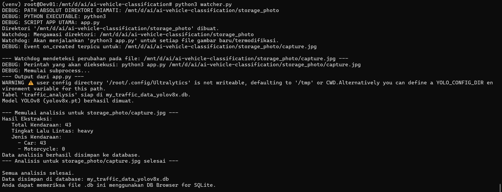

### Unlocking Parking Potential: AI-Powered Image Recognition for Real-Time Occupancy

Managing parking can be hard. Our new system makes it easy! It uses smart AI (Artificial Intelligence) and pictures to show you exactly how many parking spots are taken right now. We use a special AI called YOLOv8 to do this. Our main goal is to give you a clear, exact count of parked cars so you can manage parking much better. The data collected is also used for statistical analysis and reporting.

**How it Works (Simple Steps):**

The main thing this system uses is **pictures**. We can get these pictures in two ways:
1.  **You Take Pictures:** Someone can just take photos of the parking area with a phone or camera and put them into the system.
2.  **CCTV Cameras Take Pictures:** Even better, we can set up security cameras (CCTV) to take pictures of the parking lot automatically and send them to the system all the time.

When the system gets a picture, **Artificial Intelligence (AI) with Machine Learning** does the hard work. Here's how:

1.  **Getting the Photo Ready:** Our main computer program (a Python script) is made to take these picture files. It can get them from you uploading a file, from a folder on the computer, or straight from the cameras.

    Sample Photo Area Parkir

    

2.  **The "Watcher" Finds New Photos:**
    This is a very important part that makes everything automatic. There's a special small program called a "watcher" (it uses something like Python's `watchdog` tool). This watcher constantly looks at a specific folder (like your "storage_photo" folder).

    

    **watcher.py** 

    

    * If you put a new picture in that folder, or if an old picture changes, the watcher quickly finds it.
    * Once the watcher sees a change, it automatically tells the main program (`app.py`) to start working on that new or changed picture right away. This means you don't have to manually tell the system to check every new photo.

3.  **AI Looks at the Photo:** This is the brain of the system. The `app.py` program loads a special **Machine Learning brain** that has learned to spot things. This brain knows how to:
    * **Count Cars:** It can count how many cars are in the picture.
    * **Tell Car Types:** It can even tell if they are cars, motorcycles, buses, or trucks.
    * **Check How Busy:** It can guess how full or busy the parking lot is.
    After looking at the picture, the AI gives us numbers and details.

        

4.  **Getting the Results Clear:** After the AI does its job, we take all the numbers and details (like car counts, types) and put them into a neat, easy-to-read list.

5.  **Saving the Information:** Finally, all these clear results are automatically saved into a special storage place called a **database**. This database keeps a history of everything, so we can always look back, see how parking changes over time, make reports, and help decide things for the future.

     

 so  , this new system helps us know how parking spaces are being used very easily and without much work from people. It gives useful information to manage parking better and helps city planners.
